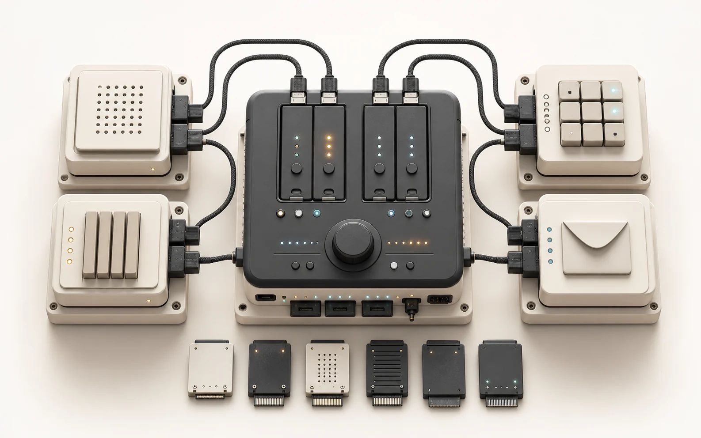
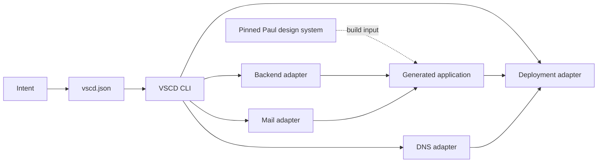

# VSCD

VSCD is a provider-composable control plane for scaffolding, verifying, and releasing small standalone applications. A versioned `vscd.json` selects DNS, backend, deployment, mail, and design-system capabilities without coupling application code to one infrastructure vendor.



## Status

| Surface | Location | Purpose |
|---|---|---|
| Public site | [vscd.moriatz.com](https://vscd.moriatz.com) | Product explanation and framework overview |
| Console | [vscd.moriatz.com/console](https://vscd.moriatz.com/console) | Authenticated project registry |
| Source | [GitHub](https://github.com/Paul-M-Kallarackal/VSCD) | CLI, contracts, console, templates, tests, and release automation |

## Quick start

Requirements: Node.js 24, pnpm 11.7.0, Git, and the CLIs required by the selected providers.

```powershell
pnpm install --frozen-lockfile
pnpm vscd providers
pnpm vscd doctor
pnpm dev:console
```

The public site runs at `http://localhost:4310/`. The registry console runs at `http://localhost:4310/console`.

Create and validate an application:

```powershell
pnpm vscd init notes-app --target ../notes-app
pnpm vscd check ../notes-app
```

Select a different provider for any capability:

```powershell
pnpm vscd init notes-app `
  --target ../notes-app `
  --dns-provider cloudflare `
  --backend-provider firebase `
  --deployment-provider netlify `
  --mail-provider backend
```

## Mental model



The manifest is the source of truth. The CLI reads it, resolves one adapter per capability, generates only the selected provider files, and applies provider-specific checks before release.

## Provider matrix

| Capability | Default | Alternative | Contract |
|---|---|---|---|
| DNS | Hostinger | Cloudflare | Conflict-safe CNAME provisioning; Cloudflare stays DNS-only |
| Backend | Supabase | Firebase | Authenticated ownership for records and objects |
| Deployment | Vercel | Netlify | Verified prebuilt artifact released by GitHub Actions |
| Mail | Hostinger Mail | Backend-managed | Server-only delivery or selected backend auth flow |
| Design system | Paul design system | None | Repository-relative local source and exact remote commit |

Provider IDs and required environment names are defined in [`packages/core/src/providers/contracts.ts`](packages/core/src/providers/contracts.ts).

## Manifest contract

Every managed repository contains a manifest version 2 file:

```json
{
  "$schema": "./schemas/vscd.schema.json",
  "manifestVersion": 2,
  "name": "Notes app",
  "slug": "notes-app",
  "framework": "vite-react",
  "projectType": "application",
  "providers": {
    "dns": { "provider": "hostinger", "domain": "example.com", "hostname": "notes.example.com" },
    "backend": { "provider": "supabase" },
    "deployment": { "provider": "vercel", "cnameTarget": "cname.vercel-dns.com" },
    "mail": { "provider": "hostinger-mail" },
    "designSystem": {
      "source": "../design-system",
      "repository": "https://github.com/Paul-M-Kallarackal/design-system",
      "commit": "<exact-40-character-commit>",
      "packages": ["@paul/ui-core", "@paul/ui-icons", "@paul/ui-patterns", "@paul/ui-tokens", "@paul/ui-themes"],
      "requiredComponents": ["DatePicker"]
    }
  }
}
```

Rules:

- `projectType: "control-plane"` is reserved for this repository.
- Generated repositories use `projectType: "application"`.
- Provider choices are independent capability slots.
- Local filesystem references are repository-relative. `DESIGN_SYSTEM_SOURCE` is the only supported machine-specific override.
- Remote builds use the commit in `.design-system-version` and clone into the ignored `.vercel-design-system/` directory.
- Secret values never belong in `vscd.json`, source, documentation, or browser variables.

The complete schema is [`schemas/vscd.schema.json`](schemas/vscd.schema.json).

## Command registry

| Command | Mutates state | Purpose |
|---|---:|---|
| `pnpm vscd providers` | No | List built-in adapters and environment contracts |
| `pnpm vscd doctor` | No | Check local tools and selected-provider authentication |
| `pnpm vscd inventory --json` | No | Return machine-readable registered project inventory |
| `pnpm vscd auth <provider>` | Yes | Store supported provider credentials outside the repository |
| `pnpm vscd init <slug> --target <path>` | Yes | Scaffold a version 2 application |
| `pnpm vscd dns <project-path>` | Yes | Provision the manifest-selected CNAME without replacing conflicts |
| `pnpm vscd check <project-path>` | No | Run provider, design-system, security, and release gates |
| `pnpm dev:console` | No | Start the public site and console locally |
| `pnpm check` | No | Run the complete workspace quality gate |
| `pnpm codex:check` | No | Validate this repository as the VSCD control plane |

Use `pnpm vscd <command> --help` for command options.

## Repository layout

```text
.
├── apps/console/               public site, registry console, and Vercel functions
│   ├── public/images/          repository-owned public media
│   └── src/features/           landing and console composition
├── packages/core/              manifest schema, normalization, registry, provider contracts
├── packages/cli/               doctor, scaffold, DNS, inventory, checks, and registration
├── templates/crud-app/         provider-neutral application template and provider files
├── schemas/                    JSON schema for vscd.json
├── supabase/                   registry migrations and RLS tests
├── docs/                       architecture and provider extension documentation
├── scripts/                    build preparation scripts
├── AGENTS.md                   binding agent contract
└── vscd.json                   this control plane's manifest
```

Detailed design documents:

- [Architecture](docs/architecture.md)
- [Provider architecture](docs/provider-architecture.md)
- [Technical design](docs/technical-design.md)

## Design-system resolution

The public site and generated applications consume public `@paul/*` entrypoints.

Resolution order:

1. `DESIGN_SYSTEM_SOURCE`, when explicitly set.
2. `providers.designSystem.source` from `vscd.json`.
3. `.vercel-design-system/`, populated for remote builds.

The repository never ships a developer-machine absolute path. Vite, TypeScript, documentation, and public assets use repository-relative or web-relative paths.

Remote builds require one server-only credential:

- `DESIGN_SYSTEM_GITHUB_TOKEN`, or
- `DESIGN_SYSTEM_DEPLOY_KEY`.

## Environment contract

Copy [`.env.example`](.env.example) to an ignored local environment file and populate only the providers you use.

| Boundary | Names |
|---|---|
| Browser-safe Supabase client | `VITE_SUPABASE_URL`, `VITE_SUPABASE_ANON_KEY` |
| Hostinger DNS control plane | `HOSTINGER_API_TOKEN`, `HOSTINGER_DOMAIN` |
| Cloudflare DNS control plane | `CLOUDFLARE_API_TOKEN`, `CLOUDFLARE_ZONE_ID` |
| Vercel release | `VERCEL_TOKEN`, `VERCEL_ORG_ID`, `VERCEL_PROJECT_ID` |
| Netlify release | `NETLIFY_AUTH_TOKEN`, `NETLIFY_SITE_ID` |
| Private design-system build | `DESIGN_SYSTEM_GITHUB_TOKEN` or `DESIGN_SYSTEM_DEPLOY_KEY` |

Admin, DNS, deployment, mail, and private-repository credentials are server-only. They must never use the `VITE_` prefix.

## Verification

Run the narrowest relevant check while editing, then run the full gate:

```powershell
pnpm --filter @vscd/console typecheck
pnpm --filter @vscd/console build
pnpm --filter @vscd/cli test
pnpm --filter @vscd/core test
pnpm check
pnpm codex:check
```

UI changes additionally require browser checks at 375, 768, 1440, and 1920 pixels, no console errors, no horizontal overflow, keyboard-visible focus, and a reduced-motion path.

## Release

Production release is manual by design:

1. Create a feature branch.
2. Commit only the requested scope.
3. Push and open a pull request.
4. Wait for `CI` to pass.
5. Merge the reviewed pull request.
6. Dispatch `Release VSCD` from the merged `main` branch.
7. Verify the Vercel deployment, `vscd.moriatz.com`, DNS, TLS, browser console, and registry URL.

Local production deployment is forbidden. The release workflow builds once and deploys the verified prebuilt artifact.

## Agent contract

Agents must read [`AGENTS.md`](AGENTS.md) before changing this repository. It defines authority, discovery order, provider invariants, relative-path rules, verification requirements, and the release boundary.
