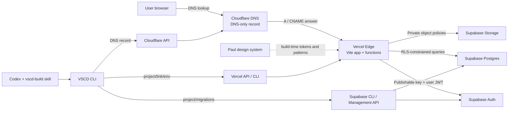
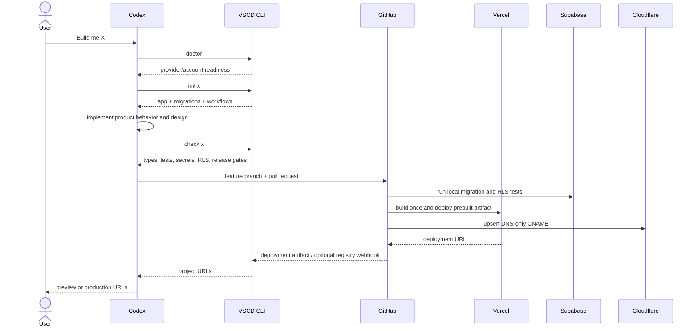

# VSCD Architecture

## Decision

VSCD manages each side project as a separate repository and provider unit. Vercel hosts the frontend and lightweight serverless endpoints. Supabase supplies Postgres, Auth, Storage, and row-level authorization. Cloudflare remains authoritative DNS and is automated through scoped API tokens. The local design system is copied into each project's implementation at scaffold time.

Cloudflare does not proxy Vercel traffic in the default architecture. Vercel currently recommends against an extra reverse proxy because it reduces traffic visibility, weakens bot/security signals, adds latency, and complicates caching. VSCD therefore writes Vercel hostnames to Cloudflare with `proxied: false` and uses Vercel's edge network and firewall for runtime traffic.

## System Map



## Control Plane And Data Plane

| Plane | Responsibility | Credentials |
|---|---|---|
| Browser | UI, user session, direct RLS-safe data access | Supabase publishable key + user JWT |
| Vercel runtime | Trusted API endpoints and orchestration callbacks | Server-only environment variables |
| Supabase | Authentication, database authorization, storage policies | JWT at runtime; PAT only for provisioning |
| Cloudflare | Authoritative DNS records | Zone-scoped API token, server/CI only |
| GitHub Actions | Production build and release | Vercel, Cloudflare, and Supabase secrets |
| Codex/VSCD | Scaffold, check, inventory, and handoff | Local CLI sessions; no secret values logged |

## “Build Me X” Sequence



## Project Boundaries

```text
VSCD repository
  apps/console        project registry and architecture view
  packages/core       manifests, registry, provider API clients
  packages/cli        doctor, inventory, init, check, register, urls
  templates/crud-app  standalone side-project starter
  supabase/            VSCD's private registry schema and RLS tests
  docs/                architecture and technical decisions

Generated project repository
  src/                 React product UI using the design system
  supabase/            schema, migrations, RLS, storage, SQL tests
  scripts/             idempotent provider automation
  .github/workflows/   CI and production release
  vscd.json            provider references, state, and URLs
```

## Authentication

- End-user authentication uses Supabase Auth. The browser receives only the publishable key and a user JWT.
- Authorization lives in Postgres RLS and Storage policies. App code does not replace database authorization.
- VSCD console records are owner-scoped by `owner_id = (select auth.uid())` for select, insert, update, and delete.
- Cloudflare automation uses an Account API token where supported, otherwise a user API token. Scope it to `Zone:Read` and `DNS:Edit` for one zone, with a TTL and IP restriction when practical.
- Vercel automation uses `VERCEL_TOKEN`, `VERCEL_ORG_ID`, and `VERCEL_PROJECT_ID` only inside GitHub Actions.
- Supabase provisioning uses a PAT for a personal control plane. OAuth2 with narrow scopes is the migration path if VSCD ever manages projects for other users.
- Cloudflare Access is not placed in front of Vercel by default. If a private admin surface needs Access, host that surface on Cloudflare Workers/Pages or accept and document the reverse-proxy tradeoff.

## Primary Sources

- [Vercel with Cloudflare guidance](https://vercel.com/kb/guide/cloudflare-with-vercel)
- [Vercel monorepos and skipped deployments](https://vercel.com/docs/monorepos)
- [Vercel remote caching](https://vercel.com/docs/monorepos/remote-caching)
- [Supabase Row Level Security](https://supabase.com/docs/guides/database/postgres/row-level-security)
- [Supabase Management API](https://supabase.com/docs/reference/api/getting-started)
- [Cloudflare API tokens](https://developers.cloudflare.com/fundamentals/api/get-started/create-token/)
- [Cloudflare DNS Records API](https://developers.cloudflare.com/api/resources/dns/subresources/records/methods/create/)

