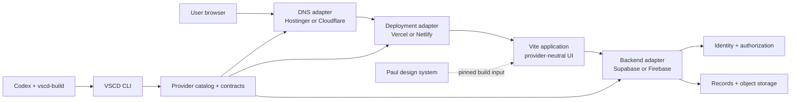
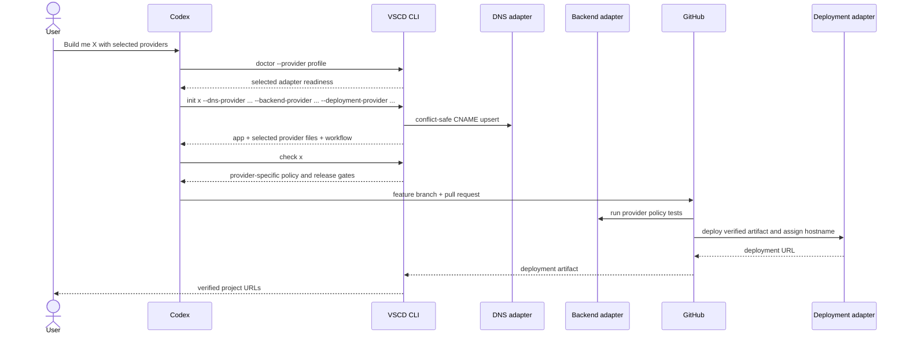

# VSCD Architecture

## Decision

VSCD manages each product as a separate repository and provider unit. The manifest selects adapters by capability: DNS, deployment, backend, and mail. Hostinger + Supabase + Vercel remains the basic profile, while Cloudflare + Firebase + Netlify is an equally valid built-in profile. The choices can be mixed independently.

Local builds resolve Paul's design system from the repository-relative manifest source or `DESIGN_SYSTEM_SOURCE`. Remote builds clone the pinned commit into `.vercel-design-system`.

## System Map



## Control And Runtime Planes

| Plane | Responsibility | Credentials |
|---|---|---|
| Browser | UI, user session, provider-neutral backend calls | Publishable Firebase or Supabase configuration |
| Backend provider | Identity, record authorization, object access | User identity at runtime; admin credentials only for trusted operations |
| Deployment provider | Static app and optional serverless endpoints | Vercel or Netlify credentials in GitHub Actions |
| DNS provider | Authoritative CNAME | Hostinger or Cloudflare token in the control plane |
| GitHub Actions | Verified production build and selected deployment workflow | Selected adapter secrets and design-system deploy key |
| Codex/VSCD | Scaffold, check, inventory, registration, URL handoff | Local authenticated CLI sessions; no logged secret values |

## Build Sequence



## Repository Boundaries

```text
VSCD repository
  apps/console        public product site and server-side web functions
  packages/core       manifest normalization, catalog, contracts, API clients
  packages/cli        doctor, inventory, scaffold, DNS, checks, registry
  templates/crud-app  base app plus provider-specific adapters/workflows
  supabase/            control-plane registry schema and policy tests
  docs/                public architecture and extension contract

Generated project
  src/lib/backend.ts  selected backend boundary
  supabase/ or *.rules selected backend authorization artifacts
  scripts/             manifest-driven DNS and build preparation
  .github/workflows/   selected deployment adapter
  vscd.json            capability selections, safe metadata, URLs
```

## Security Invariants

- DNS adapters reject conflicting record types. Cloudflare routes remain DNS-only.
- Supabase tables in exposed schemas enable RLS, grant Data API access explicitly, and ship SQL policy tests.
- Firebase documents and objects require matching authenticated ownership in committed rules.
- Browser variables may contain publishable provider configuration, never service-role/admin, DNS, mail, deployment, or deploy-key secrets.
- Production deployment runs only through the generated provider workflow after local and VSCD checks.

See [Provider architecture](provider-architecture.md) for the extension protocol.

